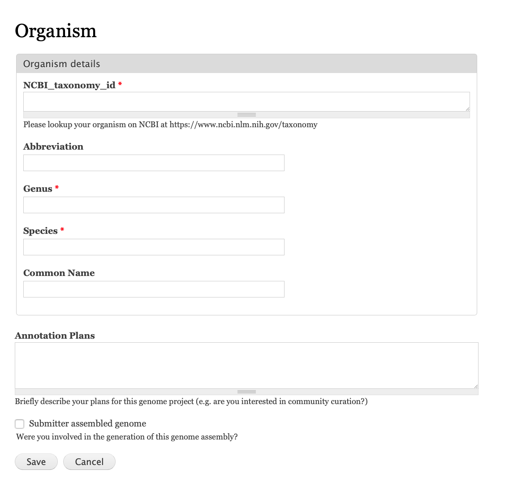
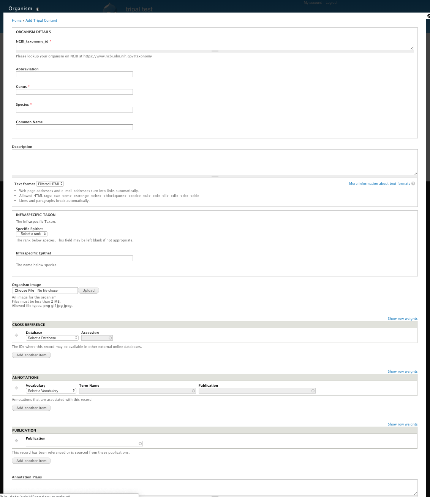

This module will configure your organism widget display to look like this for end users:

It uses the drupal_field_permissions module to hide many of the advanced fields from end users.  Admins see this organism input page:

